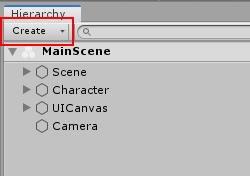
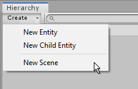

# Entities

Entities represent the building blocks of your game or app. For example, you might have an Entity which displays your player character as a sprite on-screen. You could create many entities which each represent environment objects, effects, enemies, or on-screen UI text.

Entities in Tiny mode can only exist as part of an [Entity Scene](Scenes). 

## Creating Entities

There are a number of ways to create Entities in the Editor. When you create an Entity it becomes part of an Scene in the Hierarchy.

The context menu allows you to create a new Entity, either in the root of the currently active Scene's Hierarchy, or as a child of the currently selected Entity. This menu also allows you to create a new [Entity Scene](Scenes).

**Creating Entities by dragging Assets from the Project window:**

You can also create a new Sprite Entity by dragging a Sprite Asset from your Project window into the Scene window. Unity will create the a new Entity in the currently active Scene, set up with the correct components to display the Sprite that you dragged.

<!-- TO DO : other types of asset that can be dragged into the hierarchy -->

