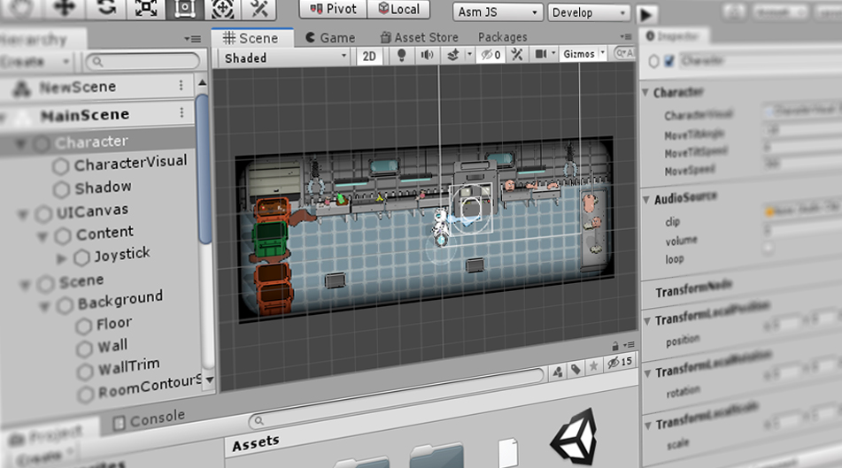

# Tiny Mode

Unity's Tiny Mode provides a set of workflow features and a specialized build pipeline that allows you to create small, lightweight games and apps in the Unity Editor. For example, you can use Tiny Mode to create playable ads or games for messaging platforms.

 
_The Unity Editor in Tiny Mode_

Tiny Mode can publish to [asm.js, and WebAssembly (Wasm)](building-and-testing).

Tiny Mode achieves this by providing you with a specialized, highly modular architecture, which represents a subset of Unity's full features, along with purpose-built tools that give you fine control over file size. This results in quicker runtimes for lightweight devices, with ultra-fast delivery and startup times.

Much of Unity's basic workflow is available in Tiny Mode, such as importing assets, using the Hierarchy view to group and structure related objects, navigating and manipulating objects in the Scene view, and viewing and editing properties in the Inspector window. However there are many differences between "Classic Unity" and Unity in Tiny Mode. If you are familliar with Classic Unity, you should read 