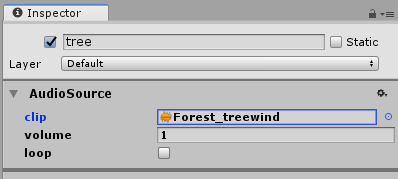

# Audio Module

The Tiny Mode Audio Module supports a subset of the audio features in classic [Unity Audio](https://docs.unity3d.com/Manual/AudioOverview.html). This page provides common use cases, an example, and a reference of the Audio components.

## Use Cases and Examples

This section demonstrates how to use the Audio module through common use cases and usage examples. If a use case or an example is similar to a topic in the Unity User Manual, a link is provided to the appropriate topic.

### Simple Audio Source

1. Create an entity.
2. Add an [AudioSource](#audiosource) component.
3. Set the `clip` property to an audio asset.
4. Set the `volume` property to 1.
5. Add an [AudioSourceStart](#audiosourcestart) component to begin playback.

After exporting your project, the audio clip will play through once.

Alternatively, you can play an AudioClip via scripting in a Tiny Mode system using an entity's AudioSource. 

## Components

### AudioClip

* Unity Reference: [AudioClip](https://docs.unity3d.com/Manual/class-AudioClip.html)

Defines a container for audio data. AudioClips are referenced and used by AudioSources to play sounds.
An AudioClip represents a single audio resource that can play back on one or more AudioSource components.

|Property|Description|
|--------|-----------|
|AudioClipStatus|The AudioClip load status. The AudioClipStatus enum defines the possible states.|

### AudioSource

* Unity Reference: [AudioSource](https://docs.unity3d.com/Manual/class-AudioSource.html)

Plays back an audio clip in an EntityGroup. Controls the volume and audio clip properties (e.g. `loop`).

An AudioSource can play a single audio clip. Multiple AudioSources can exist in separate entities.

|Property|Description|
|--------|-----------|
|clip|A Tiny Mode entity representing a reference to an audio clip (sound asset) to be played.|
|volume|Represents the audio clip playback volume **between [0..1]**.|
|loop|Determines if the audio clip should replay when it reaches the end. If **true**, the audio clip replays when it ends.|
|isPlaying|Determines if the audio clip is currently playing. If **true**, the audio clip is playing.|

### AudioSourceStart

Begins the playback of an [AudioSource]. Attach this component to an entity with an AudioSource component to start
playback the next time the AudioSystem updates.

### AudioSourceStop

Stops the playback of an [AudioSource]. Attach this component to an entity with an AudioSource component to stop
playback the next time the AudioSystem updates.

## Systems

### AudioSystem

An internal System that is automatically called to start and stop audio, load assets, and update isPlaying.

## Enums

### AudioClipStatus

Value describing the current load state of the audio data associated with an [AudioClip](#audioclip).

|Value|Description|
|-----|-----------|
|Unloaded|Value returned by AudioClip.status for an [AudioClip](#audioclip) that has no audio data loaded and where loading has not been initiated yet.|
|Loading|Value returned by AudioClip.status for an [AudioClip](#audioclip) that is currently loading audio data.|
|Loaded|Value returned by AudioClip.status for an [AudioClip](#audioclip) that has succeeded loading its audio data.|
|LoadError|Value returned by AudioClip.status for an [AudioClip](#audioclip) that has failed loading its audio data.|

(See this module's API documentation for more information)