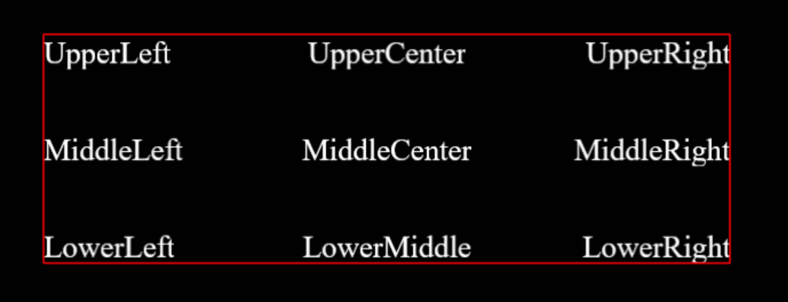
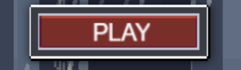
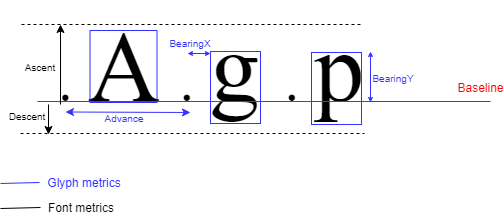

# Text Module

The **Text** and **TextHTML** modules allow you to add 2D text into your apps and define fonts.

There are two different type of fonts rendered in Canvas and WebGL.

* Native fonts - 3 different generic fonts supported by most browsers. Monospace, Serif, Sans Serif using the HTML text API.

_Note: Tiny mode doesn't support native fonts in Dotnet builds yet._

* Bitmap fonts. You can create a custom font by using the Font Asset Creator in Unity, and use them with the Text2DStyleBitmapFont component in your game. (This requires [TextMeshPro](https://docs.unity3d.com/Packages/com.unity.textmeshpro@1.3/manual/index.html)).

_Note: Tiny Mode has its own bitmap font renderer to render each character of text. Tiny Mode font rendering does not support **Signed Distance Field** bitmap fonts yet, so when creating a font texture atlas do not use the distance field render modes._

# How to use the Text Module

## Using Native Fonts:

* Create an entity 

* Add a **Text2DRenderer** component to define text and alignment

* Add a **Text2DStyle** component to add a color to your text and a font size

* Add a **Text2DStyleNativeFont** component to style specific to native fonts (italic, weight)

* Add a **NativeFont** component to specify the family font to use. 

* Add a **TransformLocalPosition** and **TransformNode** component to position the text. You can also use a **TransformLocalRotation** and a **TransformLocalScale** component to apply a rotation or a scale to your text, relative to the parent coordinate system.

* Optional:

To position your text you can also use a **RectTransform** component on your text entity. This automatically adds a TransformNode and a TransformLocalPosition to your text.

You can use the alignment attribute in the Text2DRenderer component to position your text inside of the RectTransform:

If you want the size of your text to fit inside the RectTransform, you can add a **Text2DAutofit** component. You can specify a minimum and maximum font size. The font size will be recomputed at runtime according to the text dimensions and RectTransform dimensions. If the computed size is less than the minimum size specified, the text will not be rendered. The computed size will never be bigger than the maximum font size in the text.

A common use for the **Text2DAutofit** component is to add a Text on top of a Button and auto resize it. To do this:

- Add RectTransform and Text2DAutofit on your text entity.

- Set the alignment to MiddleCenter. Set your RectTransform to cover your Button. And the text should exactly cover the whole Button. Adjust the maximum font size to prevent the text covering entirely the button.

## Using Bitmap Fonts:

###From the Editor:

* Create an empty entity

* Add a **Text2DRenderer** component to define text and alignment

* Add a **Text2DStyle** component to add a color to your text and a font size

* Add a **Text2DStyleBitmapFont** component, and use a Text Mesh Pro font asset to define the font

* Add a **RectTransform**, or **TransformNode/TransformLocalPosition/TransformLocalRotation/TransformLocalScale** to position your text. Same as using Native Fonts.

###From Script:

In addition to the previous components, you will need to define a bitmap font manually:

* Add a **BitmapFont** component. 

  * A list of Character Info

  * The font ascent (distance from the baseline to the top of the text)

  * The font descent (distance from the baseline to the bottom of the text). This value can be negative

  * The font size of the bitmap font 

  * A texture atlas image (Alpha 8-bit image) containing the representation of each glyphs. Each glyphs must be drawn parallel to the image borders and not flipped horizontally or vertically. To define and load a texture atlas use the **Image2D** and **Image2DLoadFromFile** components.

* Specify for each characters a character info

  * The unicode value. This value will be used at runtime to match the unicode value of each characters of a text.
    
  * The glyph metrics (see image below)

At runtime, Unity renders the text by rendering the corresponding glyph in the texture atlas of each character of the text added to the bitmap font component. If a character in the text is not supported by the bitmap font, it is not rendered.

The autofit functionality (**Text2DAutofit**) also works on text defined with a bitmap font. 

Glyph and Font metrics explanation:

