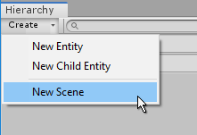
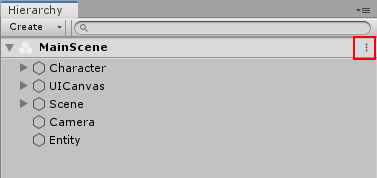

# Scenes

You can use Tiny Mode Scenes (referred to as just "Scenes" when in Tiny Mode) to group related sets of Entities that you want to use together in your game or app. Scenes can contain any number of entities, and you can arrange them in a hierarchical structure within the Scene.

Arranging your Entities in a hierarchical structure gives you a way to logically group Entities within a Scene, and also provides the same [transform parenting features](https://docs.unity3d.com/Manual/Transforms.html) as in classic Unity.

You can have multiple Scenes in the Hierarchy at any given time, and Scenes can be loaded or unloaded at runtime. Each Scene is stored as an Asset in your Project, and has the _.utdata_ filename extension.

## Creating Scenes

 
_Creating a new Scene from the Hierarchy window's Create button._

There are a number of other ways to create Scenes in Tiny Mode:

*   Click on the **Create **button at the top of the Hierachy window and select **Create Scene**.
*   Right-click within the lower part of the Hierachy window and select **New Scene **from the context menu that appears.
*   Use the Project window **Create** Button, and select **Scene**.
*   Right click within the Project window and select **Create > Scene**from the context menu.
*   Select **Assets > Create > Scene** from the main menu at the top of the Unity editor.

## Opening / Loading Scenes

You can open a Scene to edit in the editor by double-clicking the Scene asset in the Project window. Scenes are always opened _additively_ in Tiny Mode. This means opening a new scene does not close the current scene you are working on. 

## The Scene options menu

The Scene options menu is available on Scenes which you have loaded, and are therefore visible in the Hierarchy window.

To open the Scene options menu, click the Scene options button. It appears as three vertical dots, at the right-hand end of the bar containing the Scene name, in the Hierarchy window.

 
_The Scene options dropdown button in the Hierachy._

The Scene options menu allows you to perform three actions:

- Unload the Scene (which will remove it from the Hierarchy)
- Add/Remove the Scene from the currently open Project
- Add/Remove the Scene from the the Project's Startup Scenes.

## Startup Scenes

At least one Scene must be specified as a Startup Scene. These are the Scenes which will be loaded automatically when your game or app starts. You must use code to load other Scenes as required at runtime. Use the SceneService API to do this.

You can check and modify which Scenes are currently specified as Startup Scenes in the [DOTS Project Settings](settings-main).

## The Active Scene

One Scene can be the "active" Scene at any given time. The purpose of specifying an active Scene is to determine where new Entities should be created.

Some methods of creating new Entities in the editor implicitly allow you to specify the Scene they belong to while you are creating them - such as when you right-click a Scene, or drag an Asset from the Project window onto an Scene.

Other methods - such as using the **Assets > Create** menu - allow you to create an Entity without specifying a group. When you create an Entity in the editor without explicitly specifying which Scene it should belong to, it is added to whichever is the currently active group.

You can change which is the currently active group by right-clicking on an Scene in the Hierarchy window, and selecting **Set active Scene**.

**Note:** _Opening a Tiny Mode scene does not automatically open the associated Tiny Mode project. This can cause problems or confusion, because it is possible for a classic Unity project to contain multiple Tiny Mode projects. One such problem, for example, would be if you have one Tiny Mode project open (Project A), and you then open an Entity Scene associated with a different Tiny Mode project (Project B). If the Scene you opened has dependencies on modules that are included in the correct Project (Project B) but not included in the Project A's Assembly Definition, it will not work._