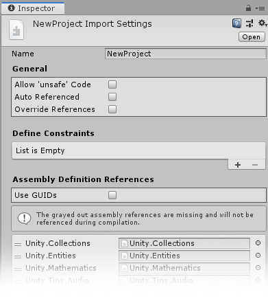
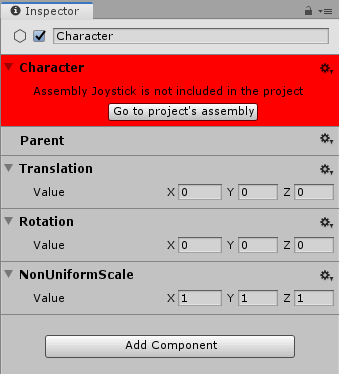

#Assembly Definition Settings

Each Tiny Mode project has an accompanying Assembly Definition file. This is created for you by default when you create a new Tiny Mode project.

Below you can see the files that are created for you by default when you create a new Tiny Mode project. The project file itself is represented by the grey file box icon, and the Assembly Definition file is represented by a jigsaw piece icon.

 and the .project file (the grey file box icon)") 
_The asset files for a default new Tiny Mode project showing the .asmdef file (the jigsaw-piece icon) and the .project file (the grey file box icon)_

The assembly definition file allows you to adjust your project's settings and specify which modules should be included in your project. You can use these settings to reduce the size of your built project by removing assemblies that your project does not use.

Assembly Definition files are not specific to Tiny Mode in Unity, therefore you can find [the documentation for Assembly Definition files in the main Unity manual](https://docs.unity3d.com/Manual/ScriptCompilationAssemblyDefinitionFiles.html).

 
_The inspector for the Assembly Definition file._

**Note:** You must make sure that **Use GUIDs** is _not_ enabled. Builds from Tiny Mode will fail if this setting is enabled.

**Note:** If you are using a component on an Entity in your Scene which does not have the correct Assembly Definition Reference added, the Inspector will show a warning when that Entity is selected, along with a button that takes you to the Assembly Definition file, as shown below:

 
_The Inspector displaying a warning about a missing Assembly._