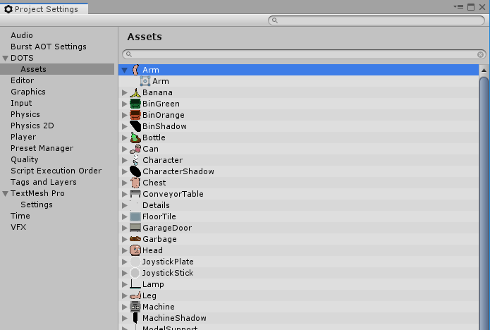

# DOTS Settings - Assets

The DOTS Assets settings panel allows you to check which assets are referenced in your project, and will therefore be included in your build.

You can use this window to browse and select assets, which causes their properties to display in the Inspector window.
