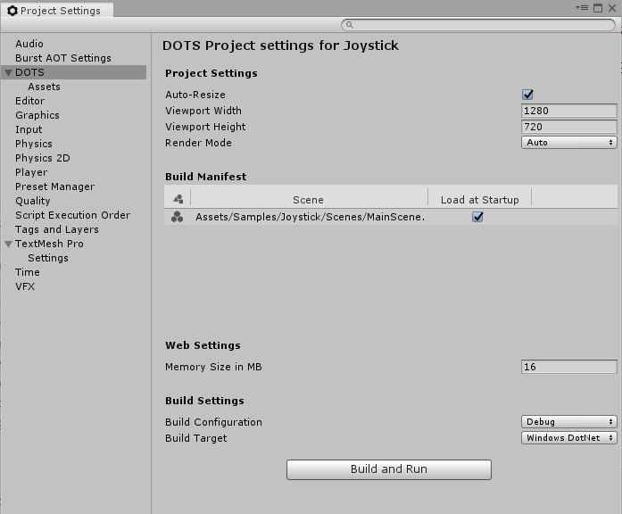

# DOTS - Main Settings

## Project Settings

|Project Settings||Description|
|:---|:---|:---|
|Auto-Resize||When enabled, the canvas automatically resizes to match the browser window size or the display resolution of the device your app is running on. If you disable this setting, the Viewport **width** and **height** fields allow you to specify a specific canvas size.|
|Viewport Width||When **Auto-resize** is disabled, this field allows you to specify the viewport width.|
|Viewport Height||When **Auto-resize** is disabled, this field allows you to specify the viewport height.|
|Render Mode:
||Auto|The best render mode is selected based on the platform or browser your app is running on. This is usually WebGL if it is available. After your app has initialized, you can read the value of this property to find out which mode was selected.|
||Canvas|An older, but more widely supported render mode. Select this option if you know you need to support older devices or browsers.|
||Web GL|A newer, but less widely supported render mode. Select this option if you are targeting newer devices and want the best performance.|

## Build Manifest

The Build Manifest displays which [Scenes](scenes) are included in the [Project](tiny-mode-projects), and allows you to control which are loaded when the Project starts up at run time.

To add a Scene to the Build Manifest, drag it from the Project window onto Build Manifest list. To remove a Scene from the Build Manifest, right-click its entry in the list, and select "Remove Scene ..." from the pop-up menu that appears.

## Web Settings

Controls settings that apply when you build to web targets.

|Web Settings||Description|
|:--|:--|:--|
|Memory Size||Allows you to specify the total memory size pre-allocated for the entire project.|

## Build Settings

Allows you to select the build target platform and build configuration.

|Build Target||Description|
|:---|:---|:---|
|Dot Net|When selected, your project is built to [Microsoft's .NET platform](https://dotnet.microsoft.com/). Unity then opens and runs the built version of your project.  |
|IL2CPP|When selected, your project is built using [Unity's IL2CPP](https://docs.unity3d.com/Manual/IL2CPP.html) (Intermediate Language to C++) technology to create a native binary. Unity then opens and runs the executable binary version of your project. |
|Asm JS|When selected, your project is built using [asm.js](https://en.wikipedia.org/wiki/Asm.js), an optimized low-level subset of Javascript. Once built, Unity opens and runs the asm.js version of your project in the default web browser on your computer. |
|Wasm|When selected, your project is as a [WebAssembly](https://en.wikipedia.org/wiki/WebAssembly) portable binary. Once built, Unity opens and runs the webAssembly version of your project in the default web browser on your computer. |

|Build Configuration||Description|
|:---|:---|:---|
|Debug|When selected, your project is built with maximum debugging features enabled. Your build will be larger, and will run much slower than Release mode, but this mode allows provides you with the most detailed stack trace information. In general, you should only use this mode when Development mode does not provide you with enough information about a specific problem to debug your app.|
|Development|When selected, your project is built with standard debugging features enabled. Your build will be larger, and will run slightly slower than Release mode, but you will be able to get standard debugging and profiling information about your project. In general, you should use this mode in the normal course of developing your app, unless it does not provide enough information to debug specific problems in your app. |
|Release|When selected, your project is built with all debugging and development features disabled, and all optimizations enabled. Your build will be smaller, and will run at full efficiency, but you will not be able to use debugging features.  Note: You **must** address all development build warnings before shipping a release build. Problems that generate development warnings in your app can break or even crash in a release build. |
