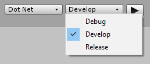

# Building and Testing

The simplest and quickest way to build your project is to click the Play button in the Editor. Unity will build your project and run the built version. You can then play-test your game or app on your computer.

*The Play button in DOTS Mode*

##Build options

DOTS Mode can build your project to various technology platforms ("targets"), and in various configurations with debug features included or omitted.

You can control these using the two drop-down menus to the left of the play button. More configuration options are available in menu **Edit > Project Settings**… then select "DOTS":

*The Target and Configuration drop-down menus in DOTS Mode*

### Build Target Control

The first drop-down menu controls the technology platform to deploy to (the Build Target).

**IMPORT IMAGE: images/build-platform-menu.png)
*The Build Target drop-down menu*

**Note:** The first time you build your project on a given platform, Unity will download the required files to perform the build - therefore the build may take a while to complete. After these files are downloaded, subsequent builds are much quicker, since they do not need to be re-downloaded.

<table>
  <tr>
    <td>Platform</td>
    <td>Description</td>
  </tr>
  <tr>
    <td>Dot Net</td>
    <td>When selected, your project is built to Microsoft's .NET platform. Unity then opens and runs the built version of your project. We recommend only using this platform for rapid iteration during development.</td>
  </tr>
  <tr>
    <td>IL2CPP</td>
    <td>When selected, your project is built using Unity's IL2CPP (Intermediate Language to C++) technology to create a native binary. Unity then opens and runs the executable binary version of your project. We recommend only using this platform for rapid iteration during development.</td>
  </tr>
  <tr>
    <td>Asm JS</td>
    <td>When selected, your project is built using asm.js, an optimized low-level subset of Javascript. Once built, Unity opens and runs the asm.js version of your project in the default web browser on your computer.</td>
  </tr>
  <tr>
    <td>Wasm</td>
    <td>When selected, your project is as a WebAssembly portable binary. Once built, Unity opens and runs the webAssembly version of your project in the default web browser on your computer.</td>
  </tr>
</table>

### Build Configuration Control

The second drop-down menu controls the build configuration.

*The Build Configuration drop-down menu*

<table>
  <tr>
    <td>Configuration</td>
    <td>Description</td>
  </tr>
  <tr>
    <td>Debug</td>
    <td>When selected, your project is built with maximum debugging features enabled. Your build will be larger, and will run much slower than Release mode, but this mode allows provides you with the most detailed stack trace information. In general, you should only use this mode when Development mode does not provide you with enough information about a specific problem to debug your app.</td>
  </tr>
  <tr>
    <td>Development</td>
    <td>When selected, your project is built with standard debugging features enabled. Your build will be larger, and will run slightly slower than Release mode, but you will be able to get standard debugging and profiling information about your project. In general, you should use this mode in the normal course of developing your app, unless it does not provide enough information to debug specific problems in your app.</td>
  </tr>
  <tr>
    <td>Release</td>
    <td>When selected, your project is built with all debugging and development features disabled, and all optimizations enabled. Your build will be smaller, and will run at full efficiency, but you will not be able to use debugging features.

Note: You must address all development build warnings before shipping a release build. Problems that generate development warnings in your app can break or even crash in a release build.</td>
  </tr>
</table>
