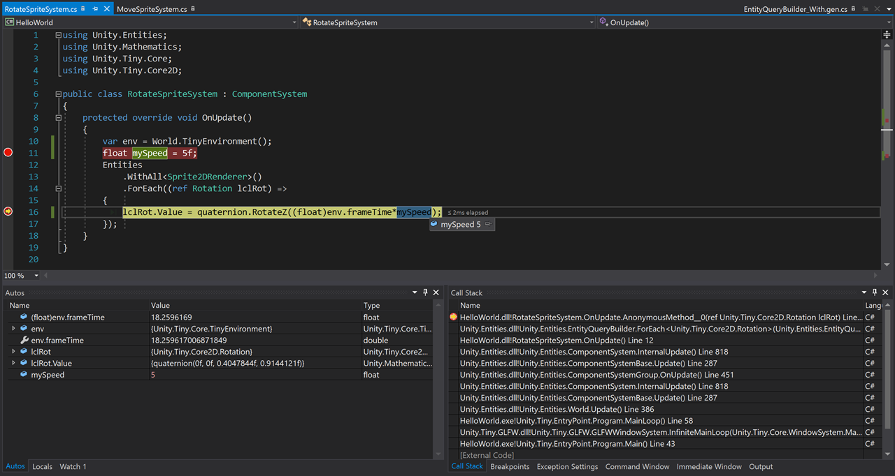

# Debugging

Once you have built your project using the chosen configuration at least once from the Editor (via menu "Assets > Open DOTS C# Project"), you can make code changes and build/run/debug code straight from the IDE.

Once you’ve opened the HelloWorld sample and built the "Windows DotNet / Debug" configuration:

In Visual Studio:

* Right-click on the "HelloWorld" project and select “Set as Startup Project”

* Make sure "windows-dotnet-debug" is the currently selected configuration

*The windows-dotnet-debug configuration option*

* Press Run. You should be able to set breakpoints, inspect data, etc. as well.

*Debugging in Visual Studio*

In JetBrains Rider:

* Switch the IDE into Solution mode from Unity mode. In the Explorer pane, make sure that "Solution" is selected at the top, instead of “Unity”.

* Make sure "windows-dotnet-debug | Default" is selected as the configuration

* Edit your current run configuration (or hit Play for the first time, where you will get the Edit Configuration dialog box)

* Select the HelloWorld project, Hit Play
