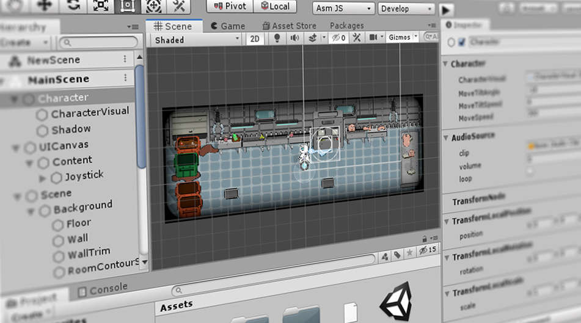

# Project Tiny (Preview)

Unity's **Project Tiny** is new a set of workflow features and a specialized build pipeline that allows you to create small, lightweight games and apps in the Unity Editor. 

 

*The Unity Editor in DOTS Mode*

Project Tiny allows you to build instant experiences targeting the Web and can publish to [asm.js, and WebAssembly (Wasm)](building-and-testing), designed for use cases like Web games, Instant Messenger games, or playable ads. 

Project Tiny uses C# and is powered by the Data-Oriented Tech Stack (DOTS). As such, it uses the Entity Component System, the Job System, and soon the Burst Compiler (even on the Web!).

With Project Tiny, we’ve introduced **DOTS Mode** in the Editor. This mode transforms the Editor to working with pure DOTS data, giving you appropriate tools and context. This is a major evolution that lays the foundation for not just Project Tiny, but [DOTS in general](https://unity.com/dots).

When in DOTS Mode, the Editor provides you with a specialized, highly modular architecture, which represents a subset of Unity's full features, along with purpose-built tools that give you fine control over file size. This results in quicker runtimes for lightweight devices, with ultra-fast delivery and startup times.

Much of Unity's basic workflow is available in DOTS Mode, such as importing assets, using the Hierarchy view to group and structure related objects, navigating and manipulating objects in the Scene view, and viewing and editing properties in the Inspector window. 

However there are many differences when the Unity Editor is in DOTS Mode, such as a different way of playing and building your project, and different player/project settings. 

**Note:** Project Tiny & the Editor DOTS Mode are in Preview, and under rapid development. As such, you should expect changes and improvements to this package. To stay up-to-date, and to give feedback, please refer to the [Project Tiny Forum](https://forum.unity.com/forums/project-tiny.151/).
