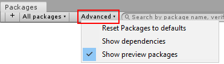
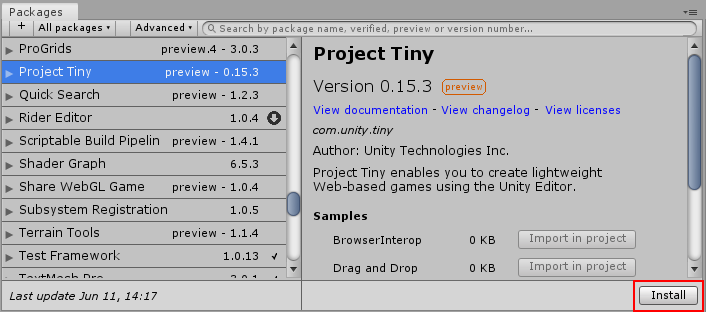

# Installing the package

## Package Manager

mFollow these steps:

* From the menu, choose **Window > Package Manager** to open the package manager.

* In the package manager, check the **Advanced** dropdown and make sure **Show Preview Packages** is enabled.

*The preview packages option in the Package Manager window*

* From the package list in the left-hand pane, choose **Project Tiny**.

* In the right-hand pane, click the **Install** button.

*The package manager window, showing the Project Tiny Install button*

## Prerequisites

Project Tiny works when installed in a new project created with Unity 2019.2 beta (b3 or above). When creating your new project, use the 2D template. We recommend you do not use an existing Unity project.

The minimum requirements for Scripting in DOTS Mode are [Visual Studio 2017 15.8](https://devblogs.microsoft.com/visualstudio/visual-studio-2017-version-15-8/) or [JetBrains Rider 2019.1](https://blog.jetbrains.com/dotnet/2019/04/30/rider-2019-1-arrived/).

