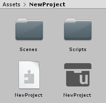
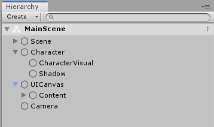
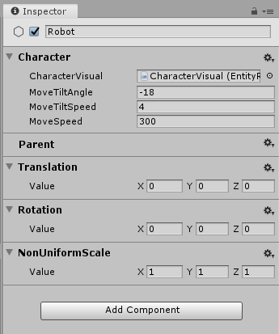

# Intro to Project Tiny & DOTS Mode for Unity developers

If you already have experience using Unity to develop games or apps, you are already well on your way to developing with Project Tiny in DOTS Mode. This page highlights the key similarities and differences between using "normal" Unity and working in DOTS Mode.

Firstly, DOTS Mode works within the context of the Unity Editor, and either directly uses or replicates many basic development tasks such as using the [Project window](https://docs.unity3d.com/Manual/ProjectView.html), [importing assets](https://docs.unity3d.com/Manual/AssetWorkflow.html), navigating the [scene view](https://docs.unity3d.com/Manual/UsingTheSceneView.html), and inspecting assets and scene objects in the [inspector](https://docs.unity3d.com/Manual/UsingTheInspector.html), all remain very similar in DOTS Mode.

However, many other workflows or features that you may be familiar with are either significantly different or not supported at all in Project Tiny & DOTS Mode. Most importantly, Project Tiny  only supports 2D sprite-based rendering and therefore has no 3D rendering capabilities. The omission of features such as 3D Rendering, Navigation, Terrain, Multiplayer, detailed Physics, etc. is by design as this enables Project Tiny to produce games and apps with such a small footprint.

Your decision on whether to use Project Tiny & DOTS Mode for your project will depend very much on the type of game or app you're making, and the characteristics and limitations of the platforms that you want to target. If you're making a game or app for consoles, MacOS or Windows, VR, or as a standalone smartphone release, Project Tiny & DOTS Mode is not yet the right choice, keep using Unity instead.  probably not the best choice. However, if you want to create messenger games, ads, or other projects with a very small file size and memory footprint, Project Tiny & DOTS Mode is the right choice.

## How does DOTS Mode differ from classic Unity?

### Basic workflow

When working with Project Tiny, DOTS Mode makes use of Unity's familiar basic workflow, such as:

* Importing assets such as textures and sounds into the Project window

* Creating and viewing Scenes in the Scene View

* Grouping related Scene-based objects together in the Hierarchy window

* Viewing and editing properties and Components in the Inspector window

### Features

DOTS Mode's workflow is based on the use of 2D Sprites. There is no support for 3D models, 3D physics, or 3D rendering.

Most of classic Unity's core features are not available. This includes Prefabs, NavMesh, Animation, Timeline, Lighting, Shadows, Terrain, VR, and more.

DOTS Mode provides its own implementation of some of classic Unity's features. For example, DOTS Mode supports Cameras, Particle Systems, Collision Detection, and Sprite Rendering, however these are not implemented in exactly the same way as they appear in classic Unity.

### ECS is enforced

From a technical point of view, the most significant difference is that Project Tiny & DOTS Mode *enforces* use of the [Entity Component System](https://en.wikipedia.org/wiki/Entity%E2%80%93component%E2%80%93system) (ECS) pattern. ECS enables significant performance benefits but you can normally choose to construct all or part of your project using ECS or not. ECS is fundamental to DOTS Mode and is not optional, so you must build your project according to ECS principles.

If you have used Unity before, but not encountered ECS, you will need to familiarize yourself with the [basic concepts of ECS](https://en.wikipedia.org/wiki/Entity%E2%80%93component%E2%80%93system).

### Project Tiny & DOTS Mode Projects

With Project Tiny, a DOTS Mode project is represented by a special Asset within a classic Unity Project, which means a single Unity Project can contain multiple DOTS Mode projects. Normally, the Unity Editor can only have one **project** open at a time. However, DOTS Mode projects are represented by an asset file with the **.project** filename suffix. DOTS Mode Projects also have an accompanying Assembly Definition file, which contains information about which [DOTS Mode modules](modules.html) are used within the DOTS Mode project, and some [settings](settings-asmdef.html) relating to the project. Below you can see the files that are created for you by default when you create a new DOTS Mode project. The project file itself is represented by the grey file box icon, and the Assembly Definition file is represented

*The asset files for a default new DOTS Mode project showing the .asmdef file (the jigsaw-piece icon) and the .project file (the grey file box icon)*

### The Hierarchy window

There are some small differences when using the Hierarchy window in DOTS Mode.

*The Hierarchy window in DOTS Mode*

Instead of Scenes and GameObjects in your hierarchy, DOTS Mode has Entity Scenes and Entities.

Entity Scenes in DOTS Mode are generally just referred to as Scenes, however from a technical point of view they are a separate type of file to classic Unity scenes (they have a different file extension and file format) and are not interchangable with classic Unity Scenes. They can only contain DOTS Mode Entities, and not classic GameObjects.

Entities, just like GameObjects, can be arranged in a hierarchical relationship inside their Scene, but it's important to remember the differences described below.

### Entity Components vs. GameObject Components

Unity GameObjects and DOTS Mode Entities share the concept of having attached components. The similarity between DOTS Mode Entity Components and classic Unity GameObject Components is strong. Just like classic Unity components, there are a number of built-in DOTS Mode components which cover features such as Camera rendering, collision, audio, particles, UI, etc, and you can add them to Entities in the inspector, just like you would add built-in components to GameObjects. In addition - similar to classic Unity MonoBehaviours - you can also create custom components yourself and add them to your Entities.

However there are some important differences. DOTS Mode components are *purely data containers*. They can contain organised, named, and related sets of data such as ints, floats, Vectors, Colors, Strings and enums, however they cannot contain any code. This is in contrast to classic Unity components which can contain both data and code. This is part of the ECS pattern that DOTS Mode follows in order to achieve fast performance and a tiny runtime footprint.

Some of the DOTS Mode components are *more granular* than their equivalent classic Unity components. For example, in classic Unity, there is a single Transform component, which contains the position, rotation and scale information for a GameObject. In DOTS Mode, each of the position, rotation and scale data are contained by separate components, meaning you can leave out the parts that you are not using.

*The inspector in DOTS Mode, showing an entity (Robot) with a custom component (Character) and Transform-related components attached.*

Another important difference is that you *cannot add more than one component of the same type* to an Entity.

### Entity Scenes vs. classic Scenes

DOTS Mode does not use classic Unity Scenes. It has its own Scene format which is specialized for storing Entities. Entity Scenes are similar to classic Scenes, having a hierarchical structure of contents, however they can only contain Entities, not GameObjects. You can have multiple Entity Scenes open in the Hierarchy at any given time, in a similar way to classic multi-scene editing, and Entity Scenes can be loaded or unloaded at runtime. Entity Scenes are stored as an Asset in your Project, but they are not the same as Unity Scene assets.

### The Inspector window

When inspecting an Entity in DOTS Mode, the Inspector window displays the DOTS Mode components attached to that Entity, in a very similar way to viewing the components attached to a GameObject. There are many built-in DOTS Mode components which are similar - but not the same as - classic Unity components.

For example, DOTS Mode has its own **Sprite2DRenderer** component, which is similar to the classic Unity [SpriteRenderer](https://docs.unity3d.com/Manual/class-SpriteRenderer.html) component, but it is in fact a separate class with a different set of features. There are other similar components in DOTS Mode relating to Animation, Particles, Tile maps, Audio, and more. However even if you are familiar with these systems in classic Unity, you will need to carefully read the documentation for their DOTS Mode equivalent components because they differ significantly.

### The Play button

In DOTS Mode, you cannot preview your project within the editor by pressing the Play button. Instead, pressing the play button performs the same action as exporting a build of your project and running the resulting build.

Because the build runs independently of the Unity editor, there is no Pause and Step button.

*The play button in DOTS Mode. Pressing this builds your projects and runs the resulting build.*

In DOTS Mode, the [build platform and build configuration controls](building-and-testing.html) are present as drop-down menus directly to the left of the Play button.

More configuration options are available under **Edit > Project Settings**, then select **DOTS**.

*DOTS Mode Project Settings*

