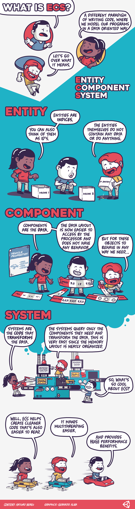

# Introduction to ECS

Because Project Tiny and DOTS Mode are built on top of the common DOTS core, most of the general Unity [ECS documentation](https://docs.unity3d.com/Packages/com.unity.entities@latest)and [DOTS Documentation applies](https://github.com/Unity-Technologies/EntityComponentSystemSamples/tree/master/Documentation~) (However, Burst is not yet working for Project Tiny). 

For a high level introduction check the infographics below:

*A high-level introduction to ECS, as an infographic*

