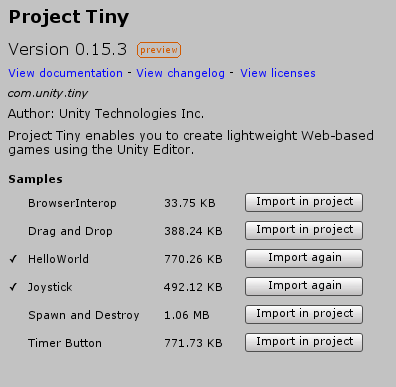
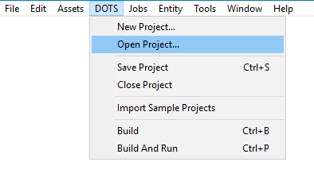
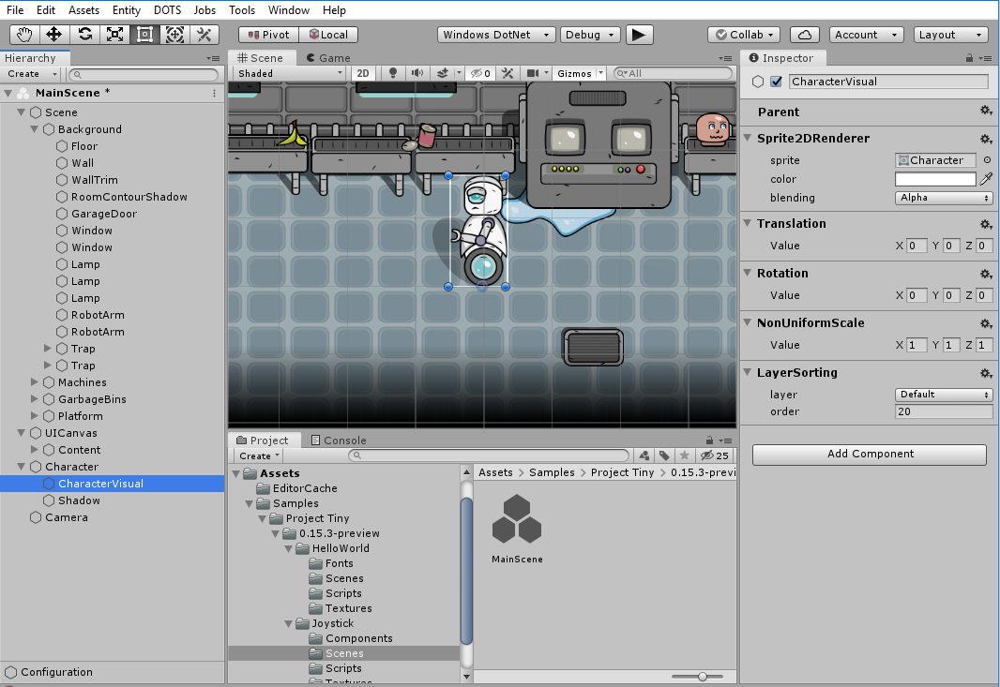

# Sample Projects

Project Tiny comes with some samples to help you learn by exploring examples of how Project Tiny projects can be put together.

You can install the samples via the Package Manager. Select the sample you want and click "Import in project". The samples are imported into your Assets folder at **/Assets/Samples/Project Tiny/[version#]-preview/**.

*The Project Tiny sample project install buttons*

Once you have imported a sample, you can open it via the ** DOTS > Open Project** menu. Locate and then select the "[SampleName].project" file.

*The DOTS Open Project menu option*

**Note**: you can have multiple samples under your "/Assets/" folder. When in DOTS Mode, the Unity Editor will only process assets located in the “[SampleName].project” you opened.

Once you have opened one of the sample projects, find and open the "Scenes/MainScene.scene" file in the Editor Project explorer.

*The "MainScene" project file from the HelloWorld sample project.*

You will see the Hierarchy window showing the entity groups for the project, and the start entity group's contents will be visible in the Scene view:

*Hierarchy view of MainScene in the Joystick Sample*

The initial preview includes a collection of simple samples to explore various features, like:

* HelloWorld: simple text displayed and sprite spinning

* BrowserInterop: how C# code can interact with JS and back

* DragAndDrop: how to use inputs and make a drag and drop functionality

* Joystick: how to create a virtual UI joystick to control character movements (keyboard & touch) including a simple camera follow.

* SpawnAndDestroy: how to load, initialize, and unload scenes.

* TimerButton: how to setup a UILayout, execute actions on the press of a button and handle a countdown timer.
