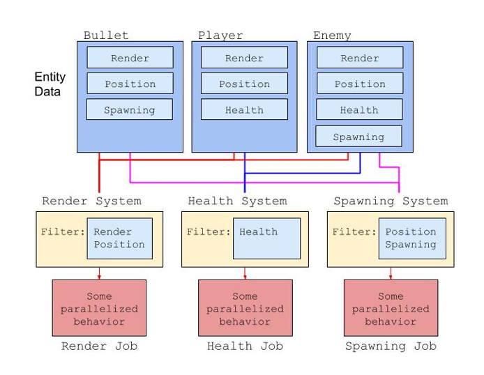

# Systems

In DOTS Mode, a **System** is a function that processes entity data.



*A diagram showing an example of scripting systems*

In the example above, the *Bullet* entity is processed by the *Render System* since it contains both the *Render* and *Position* components. It is also processed by the *Spawning System* since it contains the *Position* and *Spawning* components.

## Creating a System

First, make sure you have a Tiny project open. Then, click on the **Assets > Create > C# System** menu item to create a new script in your project's **Scripts** folder.

The **Scripts** folder is created for you by default. You can rename or move it in the Project window. You can also set it using the **Tiny** section of the **Settings** window and edit the **Script Root Directory** property.

```
using Unity.Entities;

// Scripts/NewSystem.cs

namespace game
{
    public class NewSystem : ComponentSystem
    {
        protected override void OnUpdate()
        {

        }
    }
}
```

Let's break this script down and explain every part.

`namespace game` is your Tiny project **Default Namespace** property. You can change it as needed in the [main settings](settings-main).

public class NewSystem means you're exposing the **NewSystem** class in the **game** namespace. You can change the class name as needed, but you must add the **public** modifier when declaring a system, otherwise it won't be considered.

`: ComponentSystem` means you're extending the built-in **ComponentSystem** class, which is the base class for all user-defined systems in Tiny.

`protected override void OnUpdate()` is a method you need to implement when extending the **ComponentSystem** class. It is called exactly once per frame. This method takes no parameters, and returns nothing.

## Processing Entity Data

Once you have created a new empty system as above, you can add code to it so that it processes Entity data in a useful way.

Systems can process data by iterating over entities with a specific component *specification*.

[Components are data objects](components) that implement the IComponentData interface. You must create a new class which implements IComponentData to create your own new [custom Component](creating-custom-components).

Here's a simple System example.

```
using Unity.Entities;
using Unity.Tiny.Core2D;
using Unity.Tiny.Debugging;

// Scripts/LogPosition.cs

namespace game
{
    public class LogPosition : ComponentSystem
    {
        protected override void OnUpdate()
        {
            Entities.ForEach((Entity entity, ref TransformNode transformNode) =>
            {
                var worldPos = TransformHelpers.computeWorldPosition(this, entity);
                Debug.LogFormat ( "{0} is at {1}", entity, worldPos );
            });
        }
    }
}
```

`Entities.ForEach((filter) => callback)` is how you iterate over each entity matching the given set of components in that world. Internally, Unity optimizes this loop to make it run as fast as possible.

`(Entity entity, ref TransformNode transformNode)` is a simple component type array filter that means "*give me all entities with at least the `TransformNode` component*". Adding `Entity` in a filter allows you to access the entity handle within the loop.

The section following the filter, inside the curly braces `=> { ... }` is the function called once for each entity returned by the filter.

In this example, the **LogPosition** system uses the **TransformService** to get the world position of an entity and log it. You can see the output in the *Console* section of your browser's *Developer Tools*.

* [Chrome DevTools](https://developers.google.com/web/tools/chrome-devtools/)
* [Firefox Toolbox](https://developer.mozilla.org/en-US/docs/Tools/Tools_Toolbox)
* [Safari Developer](https://support.apple.com/en-ca/guide/safari-developer/welcome/mac)

Let's consider another example.

```
// Thing.cs
// A component to store the data for radius, time and speed.

using Unity.Entities;

namespace game
{
    public struct ThingComponent : IComponentData
    {
        public float radius;
        public float time;
        public float speed;

        public static ThingComponent Default
        {
            get
            {
                var thing = new ThingComponent
                {
                    radius = 1,
                    time = 1,
                    speed = 1
                };

                return thing;
            }
        }
    }
}
```

```
// script CircleMovement.cs
// A system which operates on the Thing component defined above.

using Unity.Entities;
using Unity.Mathematics;
using Unity.Tiny.Core;

namespace game
{
    public class CircleMovement : ComponentSystem
    {
        static readonly float twoPi = (float)(2 * math.PI);

        protected override void OnUpdate()
        {
            var dt = World.TinyEnvironment.frameTime;

            Entities.ForEach((Entity entity, ref ThingComponent thing) =>
            {
                var r = thing.radius;
                var t = thing.time + dt;

                var angle = t * CircleMovement.twoPi * thing.speed;

                var x = r * math.cos(angle);
                var y = r * math.sin(angle);

                // the iteration doesn't include the `TransformLocalPosition` component,
                // you must get and set its component data explicitly, or use the `usingComponentData` helper method


                //this.world.usingComponentData(entity, [ut.Core2D.TransformLocalPosition], (position) => {
                //    position.position = new Vector3(x, y, 0);
                //});


                // `thing` is a component view - that is, you can write directly to it
                thing.time = (float)t;
            }); 
        }
    }
}
```


The **CircleMovement** system operates on every entity with a **Thing** component. Within the **OnUpdate** method, it first reads the frame delta time from the *scheduler* (in seconds), and then sets the local position of every entity returned by the filter as a function of the **time**, **radius**, and **speed** properties.

The system itself also stores a constant, 2 times Pi, to model a full rotation per second (at a speed of 1.0). Systems shouldn't store entity data outside the **OnUpdate** function, but constants like this one are fine.

The animation state is stored in the **time** property, updated every frame.

### **Scheduling Systems**

The **CircleMovement** example above will run each frame, but it could run anytime *during* a frame. That is, it could be the first system to be executed, or the last.

If you need systems to execute before or after other systems, you need to instrument your code with *decorators*.

**UpdateAfter** and **executeBefore** are two decorators you can use to schedule your systems. They take any number of system types as parameters, and create an edge in the system execution graph.

You can use the attributes <code>[UpdateAfter(typeof(MyOtherSystem))]</code> or `[UpdateBefore(typeof(MyOtherSystem))]` to control the scheduling of the system in relation to another system specified in the typeof() parameter.
